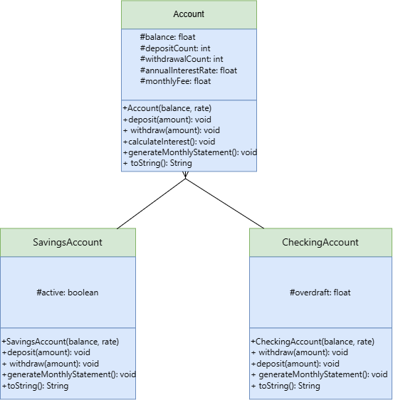
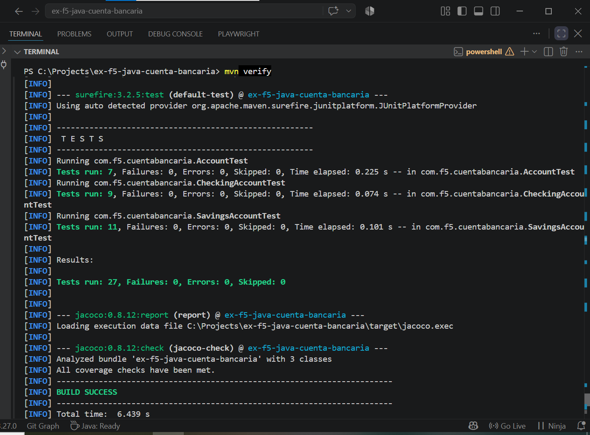
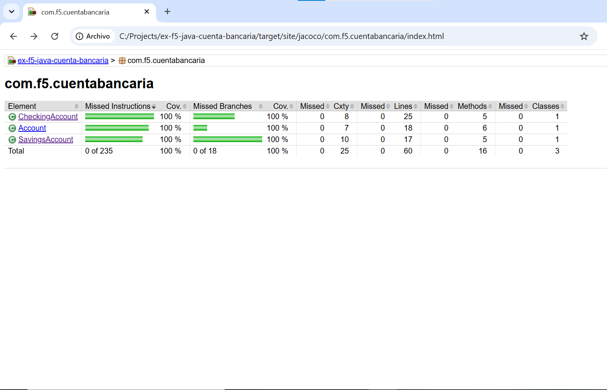
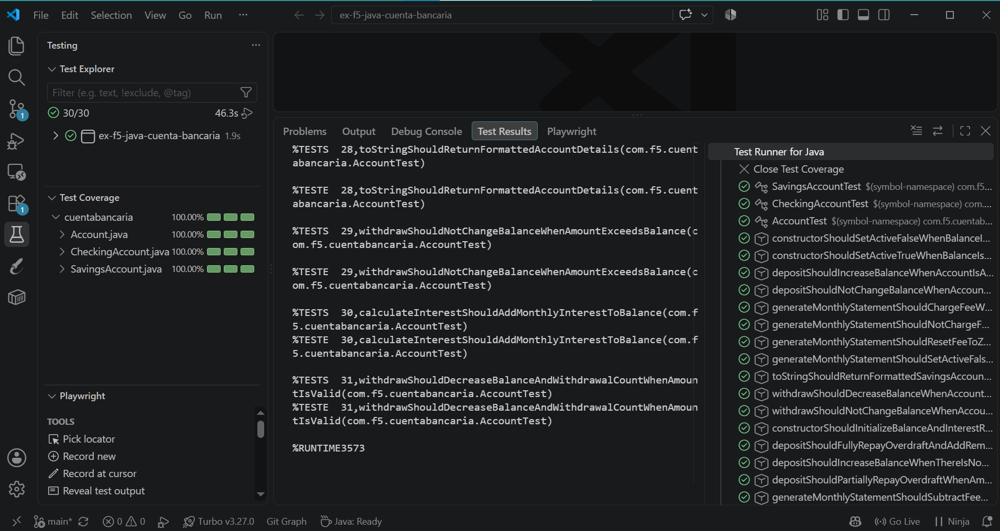

# Cuenta Bancaria — Bank Account System

A Java project that models a bank account system using object-oriented inheritance. Built as part of the F5 bootcamp curriculum, this project demonstrates class hierarchies, method overriding, encapsulation with `protected` access, and thorough unit testing with JUnit 5 and JaCoCo.

## Overview

The system models a base `Account` class with two specialized subclasses:

- **`Account`** — the base class with shared attributes (balance, deposit/withdrawal counts, interest rate, monthly fee) and core banking operations (deposit, withdraw, calculate interest, generate monthly statement).
- **`SavingsAccount`** — extends `Account`. Tracks whether the account is active based on a minimum balance threshold of $10,000. Deposits and withdrawals are only allowed while active. Charges an additional $1,000 fee for each withdrawal beyond the fourth in a statement cycle.
- **`CheckingAccount`** — extends `Account`. Supports overdraft: withdrawals exceeding the balance are allowed, with the shortfall tracked as debt. Deposits automatically repay any outstanding overdraft before adding to the balance.

## Tech stack

- Java 21
- Maven
- JUnit 5
- JaCoCo 0.8.12 (code coverage)

## Project structure

```
src/
├── main/java/com/f5/cuentabancaria/
│   ├── Account.java
│   ├── SavingsAccount.java
│   └── CheckingAccount.java
└── test/java/com/f5/cuentabancaria/
    ├── AccountTest.java
    ├── SavingsAccountTest.java
    └── CheckingAccountTest.java
```

## Setup and running

**Requirements:** Java 21, Maven.

Clone the repository:

```bash
git clone https://github.com/Raana-1375/ex-f5-java-cuenta-bancaria.git
cd ex-f5-java-cuenta-bancaria
```

Compile the project:

```bash
mvn compile
```

Run the test suite:

```bash
mvn test
```

Run the full build with coverage verification (fails if coverage drops below 70%):

```bash
mvn verify
```

## UML class diagram



The diagram shows the inheritance relationship between `Account`, `SavingsAccount`, and `CheckingAccount`, including protected attributes (`#`) and public methods (`+`).

## Testing and coverage

The project includes 27 unit tests across all three classes, covering constructors, all method behaviors, boundary conditions, and edge cases (including active/inactive account states, overdraft accumulation and repayment, and withdrawal fee tiers).

**Test run results:**



**Coverage report (100% instructions, 100% branches, 100% lines):**



**VS Code Test Explorer (30/30 passing, 100% coverage):**



## Git workflow

This project follows a feature-branch workflow with Conventional Commits (`feat:`, `fix:`, `test:`, `docs:`, `chore:`). Development happened on `feature/cuenta-classes`, merged into `main` via pull request once complete.